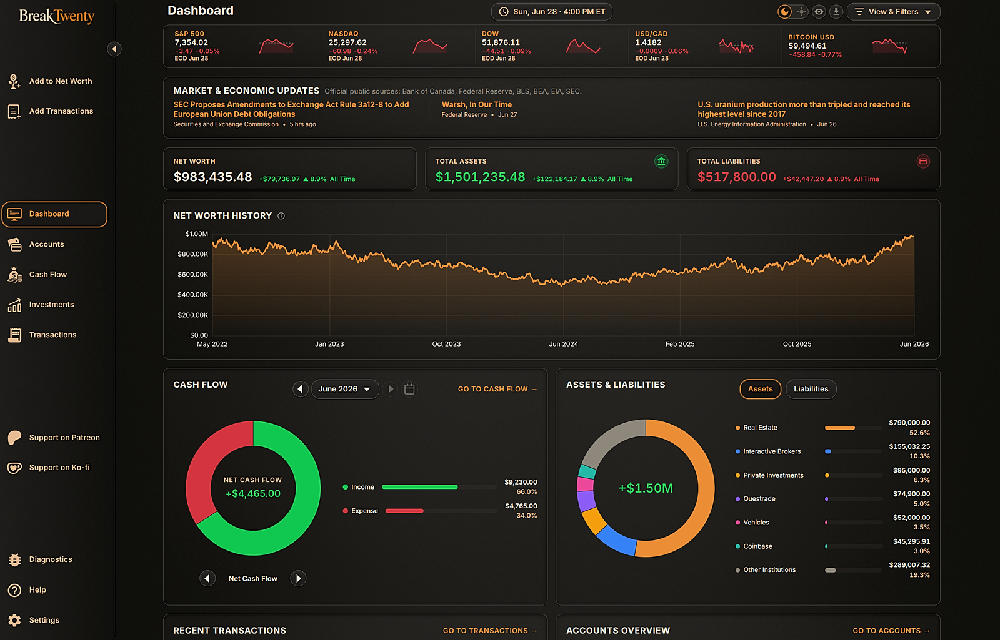
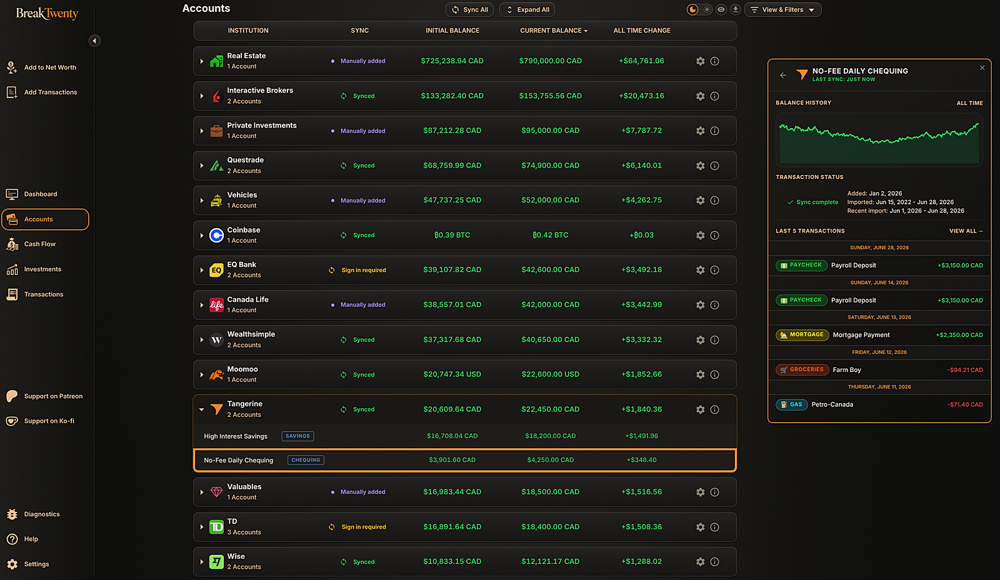
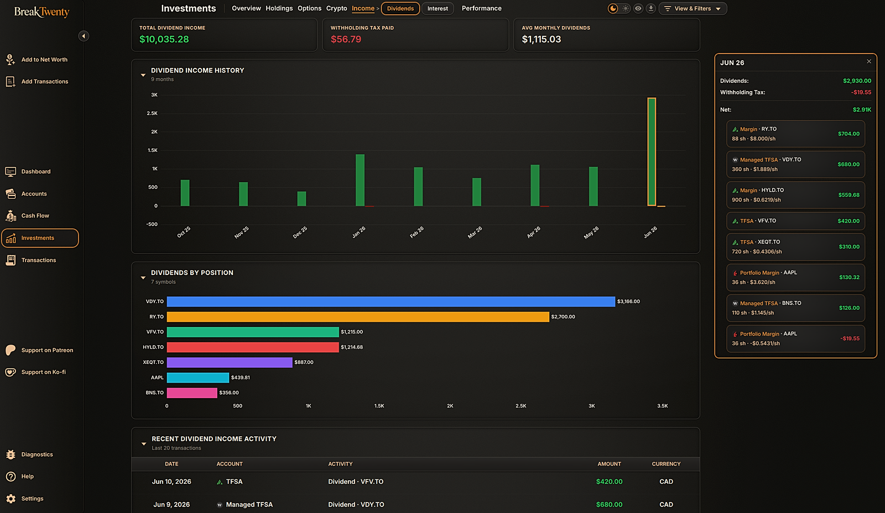

<p align="center">
  
</p>

<p align="center">
  See clearly. Move deliberately!
</p>

<p align="center">
  <strong> Linux · Windows · macOS</strong>
</p>

---



## What is BreakTwenty?

Remember when breaking a twenty-dollar bill at the store meant turning it into smaller, more useful money, enough for the decent shopping and the leftover change in your pocket?

BreakTwenty works the same way with your financial life: it consolidates your assets/liabilities in one place, then breaks everything down into clear, useful pieces so you can see how your everyday choices move you closer to the life you’re building!

BreakTwenty currently supports most major Canadian financial institutions.

Your BreakTwenty database is stored locally and encrypted. Packaged builds include the frontend, backend, and managed Python runtime and do **not** require Docker to run.

## ✨ Features

* **Net Worth Dashboard** — track assets, liabilities, account balances, allocation, and historical net worth.
* **Accounts** — view connected banks, brokerages, crypto accounts, cash, manual institutions, property, vehicles, private investments, and debt.
* **Transactions** — search, filter, categorize, edit, and review transaction history.
* **Cash Flow** — understand income, spending, category breakdowns, recurring expenses, and money movement.
* **Investments** — track holdings, allocation, performance, options, crypto, dividend income, and interest income.
* **Financial Institution Connections** — connect supported banks, brokerages, exchanges, and financial services.
* **Manual Tracking** — add accounts and assets that cannot be connected automatically.
* **Import & Export** — import supported transaction and balance history and export your financial data to CSV.
* **Local Data Storage** — financial data and saved authentication material remain on the local BreakTwenty installation.
* **Encrypted Database** — local application data is protected with SQLCipher encryption.

## 📸 App examples

### Accounts



### Investments



## 📦 Download

For normal use, download the latest BreakTwenty release from:

**[BreakTwenty Releases](https://github.com/InvictusVIII/BreakTwenty/releases/latest)**

Official releases are built for:

* **Linux x64** — AppImage and `.deb`
* **Windows x64** — installer
* **macOS Apple Silicon** — `.dmg`

Official Windows and macOS releases are signed through the BreakTwenty release pipeline.

Intel macOS users can build BreakTwenty locally from source using the instructions below.

## 🛠️ Build from Source

BreakTwenty packages are built natively for the target operating system.

### Requirements

All platforms require:

* Git
* Node.js **22.12 or newer**
* npm
* `tar`

Clone the repository:

```bash
git clone https://github.com/InvictusVIII/BreakTwenty.git
cd BreakTwenty
npm --prefix frontend ci
npm --prefix desktop ci
```

### Linux x64

Build the AppImage and Debian package:

```bash
npm --prefix desktop run dist:linux
```

The completed packages are written under:

```text
desktop/dist/electron/
```

### Windows x64

Open PowerShell or another supported terminal in the cloned repository and run:

```powershell
npm --prefix desktop run dist:win
```

The completed Windows installer is written under:

```text
desktop/dist/electron/
```

### macOS — Apple Silicon

Install the Xcode Command Line Tools if they are not already installed:

```bash
xcode-select --install
```

Then build:

```bash
npm --prefix desktop run dist:mac -- --arm64
```

The completed macOS package is written under:

```text
desktop/dist/electron/
```

### macOS — Intel

Intel macOS builds additionally require **Rust 1.83 or newer** because one packaged dependency must be compiled locally.

Install the Xcode Command Line Tools if necessary:

```bash
xcode-select --install
```

Then build:

```bash
npm --prefix desktop run dist:mac -- --x64
```

The completed macOS package is written under:

```text
desktop/dist/electron/
```

### Local Builds vs Official Releases

The packaging process automatically prepares BreakTwenty's portable Python runtime, installs the hash-locked backend dependencies, builds the frontend, assembles the embedded backend, and packages the desktop application.

Ordinary local builds do **not** use BreakTwenty's official release-signing credentials. Official release packages are built and verified through the project's release pipeline.

### Moomoo cloud OAuth probe

Before building a desktop package, Windows, macOS, or Linux can test [Moomoo's gateway-free REST API](https://open.moomoo.com/api/overview/getting-started) against a real account:

```bash
npm --prefix desktop run smoke:moomoo-cloud
```

The probe registers a public OAuth client, opens Moomoo's own browser authorization page, receives the one-time callback on `localhost:60355`, and performs read-only checks for authorized accounts, funds, positions, recent fills, recent orders, and refresh-token access. It never asks for a Moomoo password and never calls an order endpoint. Access tokens, refresh tokens, authorization codes, account identifiers, card numbers, balances, position/order/fill identifiers, symbols, names, quantities, and prices are not written to disk or retained in diagnostics. The saved diagnostic contains only OAuth stage/status metadata, hashed account references, account counts/types, supported-market codes, returned field names, currencies, and position/order/fill counts and market prefixes.

If Moomoo's approval page offers individual scope choices, select only account/trading read access. Use `--no-open` to print the authorization URL without launching the default browser, `--currency CAD` to change the funds display currency from its documented USD default, `--port 60356` if the default callback port is occupied, or `--help` for all options. The probe requires Node.js 22.12 or newer and has no Python, local gateway, or desktop-package dependency. In PowerShell environments that block `npm.ps1`, invoke the same command with `npm.cmd`.

Moomoo uses this cloud route in the web app and every Electron build on Linux, Windows, and macOS. Open **Accounts → Add Institution → Moomoo**, then choose **Continue to Moomoo**. BreakTwenty opens Moomoo's English-language passport route; Electron opens its isolated managed browser at a requested 1600 × 1000 desktop window size so Moomoo's branded layout is visible, records the resulting native window and page viewport dimensions for support, delivers the loopback callback without exposing the user's default browser profile, and closes that window when authorization finishes. On Moomoo's consent page, select every account you want to import and enable **Accounts & Orders** without **Trade Execution**. BreakTwenty rejects trading-write grants, stores the returned refresh authorization in the encrypted connection-artifact store, and imports every authorized account, balance, holding, fill, and order through the normal Moomoo sync and durable transaction-history pipeline. It never receives the Moomoo password. Routine syncs reuse the encrypted authorization and do not open a browser unless Moomoo requires reconnection. The authorization, sanitized browser-network HAR, callback, encrypted handoff, account snapshot, and transaction windows share one support-attempt ID, so the Settings diagnostic timestamp covers the whole add attempt.

## 🤝 Contributing

Bug reports, improvements, feature suggestions, documentation changes, and pull requests are welcome.

Please read **[CONTRIBUTING.md](CONTRIBUTING.md)** before submitting a contribution.

## 🔒 Security

Found a suspected security issue? Please **do not post vulnerability details publicly**.

Follow the private reporting instructions in **[SECURITY.md](.github/SECURITY.md)**.

## ⚖️ License

## Source Available — Not Open Source

BreakTwenty is **source-available, not open source**.

Personal and non-commercial use, modification, and permitted redistribution are governed by the **[BreakTwenty Source-Available License 1.0](LICENSE.md)**.

Commercial use, organizational use, business use, revenue-generating use, and monetization require separate written permission.

The exact terms in [LICENSE.md](LICENSE.md) control.
